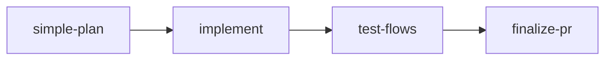
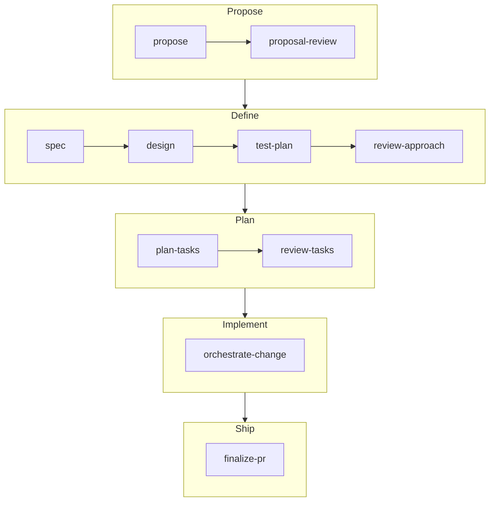

# Codagent Agent Skills

[](https://opensource.org/licenses/MIT)
[](https://coderabbit.ai)

**Make your coding agent plan, review, and ship like a careful engineer, not a fast typist.**

Left alone, AI coding agents jump straight into code: requirements stay in their head, design decisions go unexamined, and you find the gaps at review time. Codagent Agent Skills gives Claude Code, Codex, and Cursor a structured development workflow so that:

- **Plans are written down before code is.** Proposals, specs, designs, test plans, and tasks are files you can read, edit, and approve.
- **Gaps get caught early.** Adversarial reviews challenge the idea, the approach, and the task plan before any code is written.
- **Work reaches a green PR with less hand-holding.** The agent implements, tests the change like a user would, pushes, waits for CI, and fixes failures and review comments until the PR is clean.
- **One workflow works across agents.** The same skills run in Claude Code, Codex, and Cursor.
- **Bring your own spec toolkit, or none.** The skills work well with [OpenSpec](https://github.com/Fission-AI/OpenSpec) and just as well without any spec toolkit.

## Requirements

The PR skills verify changes with [Agent Validator](https://www.npmjs.com/package/agent-validator), which runs your project's checks and AI code reviews before anything is pushed. Install and initialize it in each project where you'll use Codagent:

```bash
npm install -g agent-validator
agent-validator init
```

The `init` skill verifies that `agent-validator` is version `0.15` or newer and that `.validator/config.yml` exists in the project.

## Install

```bash
claude plugin marketplace add Codagent-AI/agent-skills
claude plugin install codagent
```

## Get Started

Initialize Codagent in your project, then try the quick planning path on a small change. In Claude Code, invoke skills as slash commands:

```text
Use simple-plan skill. I want to add a --verbose flag to the CLI.
```

`simple-plan` asks the questions the full planning skills would, in one pass, then writes a short proposal, specs, and (if needed) a design for you to review. Once you approve them, ask the agent to implement the change and run `finalize-pr` to push it and see it through CI.

## How It Works

Codagent works best when each phase hands a written artifact to the next. Pick the path that fits the size of the change.

### Quick path: small, bounded changes



`simple-plan` compresses proposal, specs, and an optional design into one conversational pass. `test-flows` exercises the change through real user flows on your branch.

### Full path: features, cross-cutting work, unclear requirements



| Step | Produces |
| --- | --- |
| `propose` | A GO / NO-GO verdict and a proposal: why, scope, approach, exclusions |
| `proposal-review` | Challenges to the proposal's motivation, scope, and alternatives |
| `spec` | Requirement files with WHEN/THEN scenarios |
| `design` | `design.md` with the chosen architecture and trade-offs |
| `test-plan` | `test-plan.md` with the integration, end-to-end, and acceptance obligations |
| `review-approach` | A final cross-check of proposal, specs, design, and test plan |
| `plan-tasks` | Self-contained task files an implementer can pick up |
| `review-tasks` | Fixes to the task plan before implementation starts |
| `orchestrate-change` | The implementation, written by sub-agents with tested evidence |
| `finalize-pr` | A pushed PR with passing CI and addressed review comments |

### When to skip it

For one-off questions, debugging conversations, or quick manual edits, you don't need a skill at all.

## Skills

| When you want to… | Use |
| --- | --- |
| Set up Codagent in a project | `init` |
| Decide whether an idea is worth building | `propose` |
| Stress-test a proposal | `proposal-review` |
| Turn a proposal into requirements | `spec` |
| Choose an architecture | `design` |
| Plan what to test and how | `test-plan` |
| Review the full approach before planning tasks | `review-approach` |
| Break work into implementer-ready tasks | `plan-tasks` |
| Check the task plan against the approach | `review-tasks` |
| Check any planning artifacts for consistency | `review-spec` |
| Plan a small change in one pass | `simple-plan` |
| Implement a well-specified change with sub-agents | `orchestrate-change` |
| Smoke-test a change through real user flows | `test-flows` |
| Hunt for defects and prepare a change for human acceptance | `prepare-acceptance` |
| Commit, push, and open or update a PR | `push-pr` |
| Check CI status and review comments | `wait-ci` |
| Fix failing CI or address review comments | `fix-pr` |
| Push, wait, and fix until the PR is green | `finalize-pr` |
| Verify an implementation meets its task's requirements | `task-compliance` |
| Hand the current work to another agent session | `handoff` |
| Audit a session for risky assumptions | `session-report` |
| Review and resolve assumptions from implementer reports | `review-assumptions` |

`ask-questions` and `call-agent` are support skills that other skills invoke. The release skill under `.agents/skills/release` and `.claude/skills/release` is for maintainers of this repository and isn't part of the installed plugin.

## Documentation

- [Quickstart](docs/quickstart.md) - install, initialize, and run the first workflow
- [Workflow Guide](docs/workflow-guide.md) - how the planning, testing, and PR skills fit together
- [Skills Reference](docs/skills-reference.md) - detailed reference for every bundled skill

## Updating

```bash
claude plugin marketplace update codagent
claude plugin update codagent@codagent
```

After updating, run the init skill again in each project to verify the local setup.

## License

MIT
