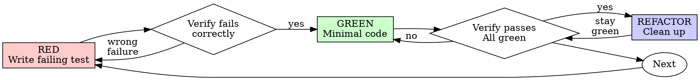

# Test-Driven Development (TDD)

## Overview

Write the test first. Watch it fail. Write minimal code to pass.

**Core principle:** Watch the test fail. Only then is it proven to test the right thing.

**Violating the letter of the rules is violating the spirit of the rules.**

## When to Use

**Always:**
- New features
- Bug fixes
- Refactoring
- Behavior changes

**Exceptions (skip TDD only for these; otherwise follow the full TDD cycle):**
- Throwaway spikes that will never be merged (branch must be deleted before implementation begins; any code carried forward requires full TDD)
- Generated code (scaffolded, not behavior-bearing)
- Configuration-only changes

Thinking "skip TDD just this once"? Stop. That's rationalization.

## The Iron Law

```
NO PRODUCTION CODE WITHOUT A FAILING TEST FIRST
```

Write code before the test? Delete it. Start over.

**No exceptions:**
- Don't keep it as "reference"
- Don't "adapt" it while writing tests
- Don't look at it
- Delete means delete

Implement fresh from tests. Period.

## Choosing Test Type

Default to unit tests. Escalate only when the thing you're testing can't be isolated:

- **Unit** — pure logic, validation, transformations, calculations. No I/O, no wiring. Fast (<100ms).
- **Integration** — components wired together: database queries, middleware chains, API clients, config reaching runtime. If the bug would only manifest when components connect, it needs an integration test.
- **E2E** — critical user flows only (login, checkout, onboarding). Expensive, slow, flaky-prone. Don't use for logic that can be tested at a lower level.

When in doubt: can you test it with a function call and an assertion? Unit test. Does it require spinning up real infrastructure or connecting real components? Integration test.

## From Spec to Tests

Each scenario in the spec becomes one test. Write the test name and assertion from the scenario before writing any implementation.

**Spec scenario:**
> **WHEN** a user with an expired session requests a protected resource
> **THEN** they receive a 401 and a redirect to login

**Test:**
```typescript
test('expired session returns 401 with login redirect', async () => {
  const session = createExpiredSession();
  const response = await requestProtectedResource(session);
  expect(response.status).toBe(401);
  expect(response.headers.location).toBe('/login');
});
```

One test per scenario, one scenario per behavior. If a scenario needs multiple assertions, that's fine — but if it needs multiple *setups*, split it. If the spec numbers its criteria (AC-1, R-001, etc.), reference the ID in the test name or comment for traceability. (Note: the spec skill does not generate IDs by default — IDs are an optional custom extension you may add to your spec for traceability.)

## Red-Green-Refactor



### RED - Write Failing Test

Write one minimal test showing what should happen.

**Good:**
```typescript
test('retries failed operations 3 times', async () => {
  let attempts = 0;
  const operation = () => {
    attempts++;
    if (attempts < 3) throw new Error('fail');
    return 'success';
  };

  const result = await retryOperation(operation);

  expect(result).toBe('success');
  expect(attempts).toBe(3);
});
```
_Clear name, tests real behavior, one thing_

**Bad:**
```typescript
test('retry works', async () => {
  const mock = jest.fn()
    .mockRejectedValueOnce(new Error())
    .mockRejectedValueOnce(new Error())
    .mockResolvedValueOnce('success');
  await retryOperation(mock);
  expect(mock).toHaveBeenCalledTimes(3);
});
```
_Vague name, tests mock not code_

**Requirements:**
- One behavior
- Clear name
- Real code (no mocks unless unavoidable)

### Verify RED - Watch It Fail

**MANDATORY. Never skip.**

```bash
npm test path/to/test.test.ts
```

Confirm:
- Test fails (not errors)
- Failure message is expected
- Fails because feature missing (not typos)

**Test passes?** You're testing existing behavior. Fix test.

**Test errors?** Fix error, re-run until it fails correctly.

### GREEN - Minimal Code

Write simplest code to pass the test.

**Good:**
```typescript
async function retryOperation<T>(fn: () => Promise<T>): Promise<T> {
  for (let i = 0; i < 3; i++) {
    try {
      return await fn();
    } catch (e) {
      if (i === 2) throw e;
    }
  }
  throw new Error('unreachable');
}
```
_Just enough to pass_

**Bad:**
```typescript
async function retryOperation<T>(
  fn: () => Promise<T>,
  options?: {
    maxRetries?: number;
    backoff?: 'linear' | 'exponential';
    onRetry?: (attempt: number) => void;
  }
): Promise<T> {
  // YAGNI
}
```
_Over-engineered_

Don't add features, refactor other code, or "improve" beyond the test. Never add test-only methods to production classes — put test helpers in test utilities.

### Verify GREEN - Watch It Pass

**MANDATORY.**

```bash
npm test path/to/test.test.ts
```

Confirm:
- Test passes
- Other tests still pass
- Output pristine (no errors, warnings)

**Test fails?** Fix code, not test.

**Other tests fail?** Fix now.

### REFACTOR - Clean Up

After green only:
- Remove duplication
- Improve names
- Extract helpers

Keep tests green. Don't add behavior.

### Repeat

Next failing test for next feature.

## Why Order Matters (Common Rationalizations)

**"I'll write tests after"** — Tests written after pass immediately. That proves nothing. Tests-after are biased by your implementation: you test what you built, not what's required. Test-first forces you to see failure, proving the test catches something real.

**"Already manually tested"** — Ad-hoc, no record, can't re-run, can't prove edge cases. Automated tests are systematic and repeatable.

**"Deleting X hours of work is wasteful"** — Sunk cost fallacy. Keeping unverified code is the real waste. Delete and rewrite with TDD gives high confidence; bolting tests onto existing code gives false confidence.

**"TDD is dogmatic / too slow"** — TDD is faster than debugging in production. It finds bugs before commit, prevents regressions, documents behavior, and enables safe refactoring.

**"Keep as reference, write tests first"** — You'll adapt it. That's testing after with extra steps. Delete means delete.

**"Hard to test"** — Listen to the test. Hard to test = hard to use. Simplify the design.

If you catch yourself rationalizing, delete code and start over with TDD.

## Example: Bug Fix

**Bug:** Empty email accepted

**RED**
```typescript
test('rejects empty email', async () => {
  const result = await submitForm({ email: '' });
  expect(result.error).toBe('Email required');
});
```

**Verify RED**
```bash
$ npm test
FAIL: expected 'Email required', got undefined
```

**GREEN**
```typescript
function submitForm(data: FormData) {
  if (!data.email?.trim()) {
    return { error: 'Email required' };
  }
  // ...
}
```

**Verify GREEN**
```bash
$ npm test
PASS
```

**REFACTOR**
Extract validation for multiple fields if needed.

## Verification Checklist

Before marking work complete:

- [ ] Every spec scenario has a test
- [ ] Every new function/method has a test
- [ ] Watched each test fail before implementing
- [ ] Each test failed for expected reason (feature missing, not typo)
- [ ] Wrote minimal code to pass each test
- [ ] All tests pass
- [ ] Output pristine (no errors, warnings)
- [ ] Tests use real code (mocks only if unavoidable)
- [ ] Edge cases and errors covered

Can't check all boxes? You skipped TDD. Start over.

## When Stuck

| Problem | Solution |
|---------|----------|
| Test too complicated | Design too complicated. Simplify interface. |
| Must mock everything | Code too coupled. Use dependency injection. |
| Test setup huge | Extract helpers. Still complex? Simplify design. |
| Mock setup > test logic | Understand real method's side effects before mocking. Mock at the lowest level necessary. Consider integration tests instead. |

## Final Rule

```
Production code → test exists and failed first
Otherwise → not TDD
```
