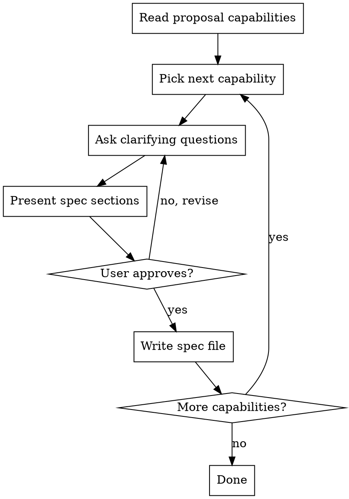

# Spec

## Overview

Help turn proposals into fully specified requirements through natural collaborative dialogue.

Start by reading the proposal's Capabilities section to know which spec files to create, then walk through each capability conversationally — asking questions one at a time to elicit behaviors, boundaries, error conditions, and edge cases. Once you have enough information for a capability, present the proposed requirements and scenarios for user approval, then write the spec file.

<HARD-GATE>
Do NOT write any spec files until you have presented the proposed requirements and scenarios to the user and received approval for that capability. This applies to EVERY capability regardless of perceived simplicity.
</HARD-GATE>

## Anti-Pattern: "The Design Will Figure It Out"

Every capability needs its behavioral contract specified before design begins. Edge cases, error conditions, and boundaries that feel "obvious" are where misaligned assumptions cause the most rework. The spec can be short (a few scenarios for simple capabilities), but you MUST elicit them conversationally and get approval.

## Checklist

You MUST create a task for each of these items and complete them in order:

1. **Read the proposal** — identify the Capabilities section and the list of capabilities to spec. Skip if you just wrote the proposal in this session.
2. **For each capability** — walk through the conversational requirement-discovery process:
   a. **Ask clarifying questions** — one at a time, understand behaviors, boundaries, error conditions, edge cases
   b. **Present spec sections for approval** — show the proposed requirements and scenarios, get user approval
   c. **Write the spec file** — using the Artifact Template below
3. **Write deferred-to-design markers** — for scenarios that depend on unresolved architectural choices

## Process Flow



## The Process

**Reading the proposal:**
- If you wrote the proposal earlier in this session, you already have context — skip re-reading it
- Otherwise, open the proposal's Capabilities section
- Use the capability names to determine which spec files to create (one per capability)
- Work through capabilities one at a time

**Asking clarifying questions:**
- Ask questions one at a time to understand the behavioral contract for each capability
- Prefer multiple-choice questions when possible, but open-ended is fine too
- Only one question per message — if a topic needs more exploration, break it into multiple questions
- Focus on: what the system does (behaviors), what it rejects (boundaries), what goes wrong (error conditions), unusual situations (edge cases)
- Do NOT ask about architecture, patterns, or technical approach — that belongs in design

**When a requirement depends on architectural knowledge:**
- Acknowledge the dependency explicitly
- Ask a best-effort question to capture as much as is knowable without the architecture
- Mark the scenario with `<!-- deferred-to-design: <reason> -->` — the design skill will complete or revise it
- A spec file with deferred scenarios is still considered complete and unblocks design

**Presenting for approval:**
- Once you have enough for a capability, present the full set of proposed requirements and scenarios
- Ask after presenting whether it looks right before writing the file
- Be ready to go back and revise if something doesn't look right

**Writing spec files:**
- Write each spec file using the Artifact Template below
- Every requirement MUST have at least one scenario

## Deferred-to-Design Scenarios

When a scenario's behavior depends on an unresolved architectural decision, write the scenario with a best-effort condition and outcome, and add a `<!-- deferred-to-design: <reason> -->` comment explaining what architectural decision is needed to complete it.

The design skill reads all spec files before starting and will complete or revise these scenarios when it has the architectural context.

## After All Capabilities Are Specced

Tell the user the relative path of each spec file created. This skill does not invoke other skills or manage sequencing.

## Key Principles

- **One question at a time** — Don't overwhelm with multiple questions
- **Multiple choice preferred** — Easier to answer than open-ended when possible
- **Focus on "what", not "how"** — Behaviors, boundaries, and error conditions — not architecture
- **Deferred is valid** — A deferred-to-design marker is better than a forced answer
- **Incremental validation** — Present spec for each capability, get approval before writing
- **Be flexible** — Go back and revise when something doesn't look right

## Artifact Template

Use this structure when writing spec files. Create one spec file per capability listed in the proposal's Capabilities section.

- **New capabilities**: use the exact kebab-case name from the proposal (`specs/<capability>/spec.md`).
- **Modified capabilities**: use the existing spec folder name when creating the delta spec.

### Format rules

- Each requirement: `### Requirement: <name>` followed by description
- Use SHALL/MUST for normative requirements (avoid should/may)
- Each scenario: `#### Scenario: <name>` with WHEN/THEN format
- **Scenarios MUST use exactly 4 hashtags (`####`).** Using 3 or bullets will break parsing.
- Every requirement MUST have at least one scenario

### Abstraction level

Scenarios describe observable behavioral contracts — what the system does when invoked under specific conditions. Focus on orchestration behavior (dispatch, gating, error handling, control flow), NOT file contents or internal structure.

Write scenarios as behavioral contracts the capability guarantees to its callers:
- GOOD: "WHEN subagent finds task ambiguous THEN it returns questions without implementing"
- GOOD: "WHEN gauntlet retry limit is exhausted THEN subagent returns failure to coordinator"
- BAD:  "WHEN SKILL.md is read THEN it contains TDD instructions"
- BAD:  "WHEN config file exists THEN it has the correct YAML keys"

### Delta operations

Use `##` headers to categorize changes:

- **ADDED Requirements** — New capabilities
- **MODIFIED Requirements** — Changed behavior. MUST include full updated content.
- **REMOVED Requirements** — Deprecated features. MUST include Reason and Migration.
- **RENAMED Requirements** — Name changes only. Use FROM:/TO: format.

When modifying existing requirements: if a prior spec file exists, copy the ENTIRE requirement block (from `### Requirement:` through all scenarios), paste under `## MODIFIED Requirements`, and edit to reflect new behavior. Using MODIFIED with partial content loses detail. If no prior spec file exists, investigate the existing code to understand current behavior, then write the full modified requirement (including all scenarios) as it should be after the change. If adding new concerns without changing existing behavior, use ADDED instead.

### Template

```markdown
## ADDED Requirements

### Requirement: <!-- requirement name -->
<!-- requirement text -->

#### Scenario: <!-- scenario name -->
- **WHEN** <!-- condition -->
- **THEN** <!-- expected outcome -->

<!--
  Example of additional delta sections:

  ## REMOVED Requirements

  ### Requirement: Legacy export
  **Reason**: Replaced by new export system
  **Migration**: Use new export endpoint at /api/v2/export
-->
```
